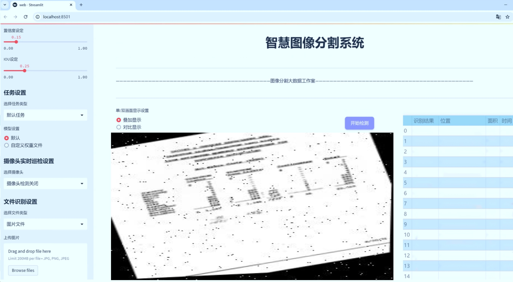
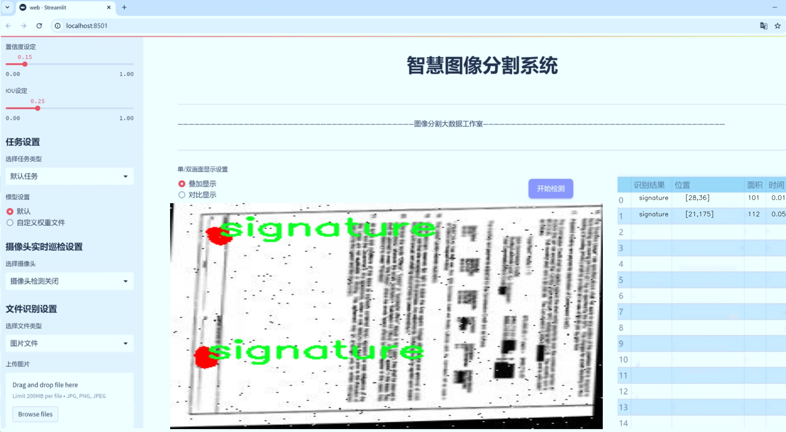
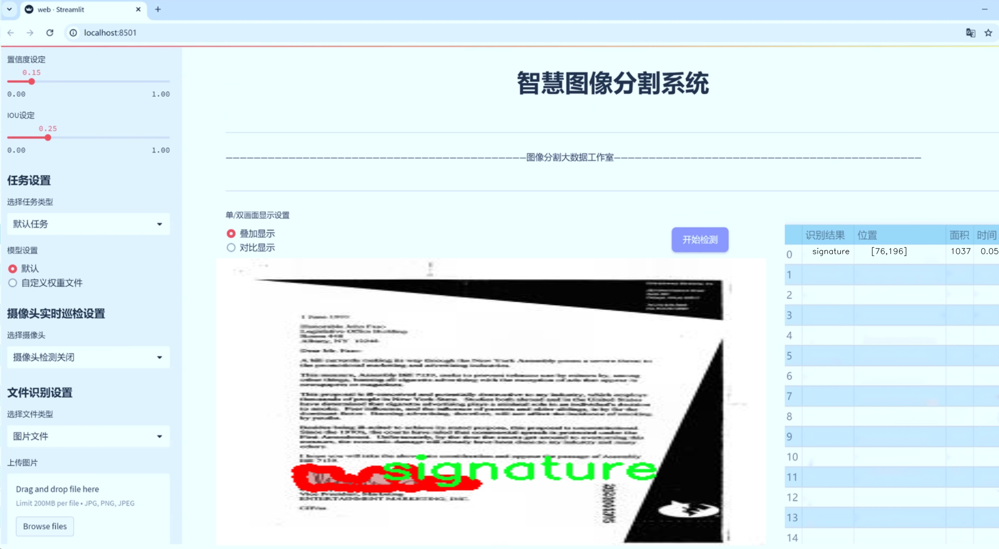
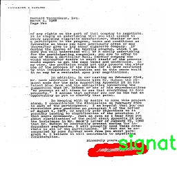

# 签名与印章分割系统： yolov8-seg-p2

### 1.研究背景与意义

[参考博客](https://gitee.com/YOLOv8_YOLOv11_Segmentation_Studio/projects)

[博客来源](https://kdocs.cn/l/cszuIiCKVNis)

研究背景与意义

随着信息技术的迅猛发展，数字化签名和印章在电子商务、在线交易及法律文件等领域的应用日益广泛。然而，传统的手写签名和印章在数字化过程中面临着诸多挑战，包括图像质量、背景复杂性及签名和印章的多样性等。这些因素使得自动化的签名与印章识别和分割成为一项复杂的任务。为了提高签名与印章的处理效率和准确性，基于深度学习的图像分割技术逐渐成为研究的热点。YOLO（You Only Look Once）系列模型因其优越的实时性和高效性，在目标检测和分割领域得到了广泛应用。特别是YOLOv8模型，凭借其改进的网络结构和优化的训练策略，展现出了更强的特征提取能力和更高的分割精度。

本研究旨在基于改进的YOLOv8模型，构建一个高效的签名与印章分割系统。我们使用的“Signature_annotations”数据集包含2200幅图像，涵盖了两类目标：签名和印章。这一数据集的丰富性为模型的训练和评估提供了良好的基础。通过对该数据集的深入分析，我们可以提取出签名和印章的特征信息，进而优化模型的训练过程，提升分割的准确性和鲁棒性。

在当前的研究背景下，尽管已有一些基于深度学习的签名与印章识别方法，但大多数方法在处理复杂背景、变形签名和印章时仍存在一定的局限性。传统的图像处理技术往往依赖于手工特征提取，难以适应多样化的应用场景。因此，基于YOLOv8的改进方法不仅能够有效解决这些问题，还能在实时性和准确性之间取得良好的平衡，满足实际应用的需求。

本研究的意义在于通过引入先进的深度学习技术，推动签名与印章分割领域的发展。首先，改进的YOLOv8模型将为签名与印章的自动化处理提供一种新的解决方案，降低人工干预的需求，提高工作效率。其次，研究成果将为相关领域的研究者提供参考，促进深度学习技术在文档处理、金融安全及法律事务等领域的应用。此外，研究中使用的数据集也将为后续的研究提供基础数据支持，推动该领域的进一步探索。

综上所述，基于改进YOLOv8的签名与印章分割系统的研究不仅具有重要的理论价值，还有着广泛的实际应用前景。通过深入探讨和优化模型，我们期望能够在签名与印章的自动识别与分割方面取得突破，为数字化转型和智能化应用提供有力支持。

### 2.图片演示







注意：本项目提供完整的训练源码数据集和训练教程,由于此博客编辑较早,暂不提供权重文件（best.pt）,需要按照6.训练教程进行训练后实现上图效果。

### 3.视频演示

[3.1 视频演示](https://www.bilibili.com/video/BV1RxzXYVE47/)

### 4.数据集信息

##### 4.1 数据集类别数＆类别名

nc: 1
names: ['signature']


##### 4.2 数据集信息简介

数据集信息展示

在本研究中，我们使用了名为“Signature_annotations”的数据集，以支持对YOLOv8-seg模型在签名与印章分割任务中的改进与训练。该数据集专门设计用于处理与签名相关的图像数据，旨在提高模型在识别和分割签名方面的准确性和效率。数据集的类别数量为1，具体类别为“signature”，这意味着所有的标注和训练样本均围绕这一特定类别展开，确保了数据集的专一性和针对性。

“Signature_annotations”数据集包含了多种不同风格和格式的签名图像，涵盖了手写签名、电子签名以及各种印章的图像。这些图像经过精心挑选和标注，确保了每个样本的质量和多样性。通过对不同背景、光照条件和书写工具的样本进行收集，数据集不仅提供了丰富的训练材料，还能够有效地模拟现实世界中可能遇到的各种情况。这种多样性对于提升YOLOv8-seg模型的泛化能力至关重要，使其能够在不同的应用场景中表现出色。

在数据集的构建过程中，标注团队采用了严格的标注标准，确保每个签名和印章的边界都被准确地勾勒出来。这种高质量的标注为模型的训练提供了可靠的监督信号，使得模型能够学习到如何在复杂背景中精确地分割出目标对象。数据集中的每一幅图像都附带了相应的标注文件，标明了签名的具体位置和轮廓，这为后续的模型训练和评估提供了必要的基础。

为了进一步增强数据集的实用性，研究团队还对图像进行了多种数据增强处理，如旋转、缩放、裁剪和颜色调整等。这些处理不仅增加了数据集的样本数量，还帮助模型更好地适应不同的输入变化，提高了其鲁棒性。通过这种方式，模型能够在面对不同风格和格式的签名时，依然保持高效的分割性能。

在训练过程中，使用“Signature_annotations”数据集的目标是使YOLOv8-seg模型能够准确识别并分割出图像中的签名与印章区域。这一过程不仅涉及到模型的架构设计和参数调整，还需要对数据集进行细致的分析和评估，以确保模型在训练后能够达到预期的性能指标。通过对训练结果的不断迭代和优化，研究团队期望能够实现更高的分割精度和更快的处理速度，为实际应用提供强有力的技术支持。

总之，“Signature_annotations”数据集为本研究提供了一个坚实的基础，助力于改进YOLOv8-seg模型在签名与印章分割任务中的表现。通过对该数据集的深入分析和应用，我们希望能够推动相关领域的研究进展，为未来的签名识别和印章处理技术奠定基础。




### 5.项目依赖环境部署教程（零基础手把手教学）

[5.1 环境部署教程链接（零基础手把手教学）](https://www.bilibili.com/video/BV1jG4Ve4E9t/?vd_source=bc9aec86d164b67a7004b996143742dc)


[5.2 安装Python虚拟环境创建和依赖库安装视频教程链接（零基础手把手教学）](https://www.bilibili.com/video/BV1nA4VeYEze/?vd_source=bc9aec86d164b67a7004b996143742dc)

### 6.手把手YOLOV8-seg训练视频教程（零基础手把手教学）

[6.1 手把手YOLOV8-seg训练视频教程（零基础小白有手就能学会）](https://www.bilibili.com/video/BV1cA4VeYETe/?vd_source=bc9aec86d164b67a7004b996143742dc)


按照上面的训练视频教程链接加载项目提供的数据集，运行train.py即可开始训练



     Epoch   gpu_mem       box       obj       cls    labels  img_size
     1/200     0G   0.01576   0.01955  0.007536        22      1280: 100%|██████████| 849/849 [14:42<00:00,  1.04s/it]
               Class     Images     Labels          P          R     mAP@.5 mAP@.5:.95: 100%|██████████| 213/213 [01:14<00:00,  2.87it/s]
                 all       3395      17314      0.994      0.957      0.0957      0.0843

     Epoch   gpu_mem       box       obj       cls    labels  img_size
     2/200     0G   0.01578   0.01923  0.007006        22      1280: 100%|██████████| 849/849 [14:44<00:00,  1.04s/it]
               Class     Images     Labels          P          R     mAP@.5 mAP@.5:.95: 100%|██████████| 213/213 [01:12<00:00,  2.95it/s]
                 all       3395      17314      0.996      0.956      0.0957      0.0845

     Epoch   gpu_mem       box       obj       cls    labels  img_size
     3/200     0G   0.01561    0.0191  0.006895        27      1280: 100%|██████████| 849/849 [10:56<00:00,  1.29it/s]
               Class     Images     Labels          P          R     mAP@.5 mAP@.5:.95: 100%|███████   | 187/213 [00:52<00:00,  4.04it/s]
                 all       3395      17314      0.996      0.957      0.0957      0.0845


### 7.50+种全套YOLOV8-seg创新点加载调参实验视频教程（一键加载写好的改进模型的配置文件）

[7.1 50+种全套YOLOV8-seg创新点加载调参实验视频教程（一键加载写好的改进模型的配置文件）](https://www.bilibili.com/video/BV1Hw4VePEXv/?vd_source=bc9aec86d164b67a7004b996143742dc)

### YOLOV8-seg算法简介

原始YOLOv8-seg算法原理

YOLOv8-seg算法是Ultralytics公司在2023年推出的最新目标检测和图像分割模型，它在前几代YOLO算法的基础上进行了显著的改进和创新，尤其是在结构设计和性能优化方面。YOLOv8-seg不仅延续了YOLO系列的高效性和准确性，还引入了新的特性，使其在多种计算机视觉任务中表现出色。其核心思想是将目标检测与图像分割任务结合，通过改进的网络结构和算法，提升了模型的泛化能力和适应性。

YOLOv8-seg的网络结构由输入层、主干网络、颈部网络和头部网络组成。输入层负责接收图像数据，默认的输入尺寸为640x640像素。为了适应不同长宽比的图像，YOLOv8-seg采用自适应缩放策略，能够有效减少信息冗余并提高推理速度。在训练过程中，YOLOv8-seg使用Mosaic数据增强技术，将四张随机选择的图像进行缩放和拼接，以生成新的训练样本。这种增强方法使得模型能够学习到不同位置和周围像素的特征，从而提升了模型的鲁棒性和准确性。

在主干网络部分，YOLOv8-seg引入了C2F模块，取代了YOLOv5中的C3模块。C2F模块通过并行化更多的梯度流分支，增强了特征提取的能力，同时保持了模型的轻量化。这一设计灵感来源于YOLOv7中的ELAN模块，旨在提高特征流动性，进而改善检测精度。主干网络的末尾采用了SPP（Spatial Pyramid Pooling）模块，通过多尺度池化操作，进一步增强了特征的抽象能力，使得模型能够更好地处理不同尺度的目标。

颈部网络的设计则采用了FPNS（Feature Pyramid Network）和PAN（Path Aggregation Network）结构，以融合来自不同尺度的特征图信息。这一过程确保了多层次特征的有效传递，提升了模型在复杂场景下的表现。通过将不同层次的特征进行有效整合，YOLOv8-seg能够更准确地定位和分割目标物体。

在头部网络部分，YOLOv8-seg的设计变化尤为显著。它采用了解耦头（Decoupled Head）结构，将目标检测和分类任务分开处理。具体而言，输入特征图经过两个1x1卷积模块降维后，分别进入两个分支进行类别预测和边界框回归。这种解耦设计使得模型在处理不同任务时能够更专注于各自的目标，提升了整体性能。此外，YOLOv8-seg还引入了Distribution Focal Loss（DFL）和CIoU Loss（Complete Intersection over Union Loss）作为损失函数，旨在快速聚焦于标签附近的数值，从而提高模型的学习效率和准确性。

值得注意的是，YOLOv8-seg摒弃了传统的Anchor-Based（基于锚框）方法，转而采用Anchor-Free（无锚框）策略。这一转变使得目标检测过程更加灵活，不再依赖于预设的锚框，降低了计算复杂度，同时提升了模型的泛化能力。通过将目标检测转化为关键点检测，YOLOv8-seg能够更有效地适应不同的数据集和目标特征，减少了对锚框参数的依赖。

总的来说，YOLOv8-seg算法通过一系列创新的设计和优化，成功地将目标检测与图像分割任务结合，展现出卓越的性能。其在输入层的自适应缩放、主干网络的C2F模块、颈部网络的特征融合以及头部网络的解耦设计等方面的改进，使得YOLOv8-seg在处理复杂视觉任务时表现得更加高效和准确。这些创新不仅提升了模型的性能，也为未来的计算机视觉研究提供了新的思路和方向。随着YOLOv8-seg的广泛应用，预计将在自动驾驶、智能监控、医疗影像分析等领域发挥重要作用，推动相关技术的进一步发展。


### 9.系统功能展示（检测对象为举例，实际内容以本项目数据集为准）

图9.1.系统支持检测结果表格显示

  图9.2.系统支持置信度和IOU阈值手动调节

  图9.3.系统支持自定义加载权重文件best.pt(需要你通过步骤5中训练获得)

  图9.4.系统支持摄像头实时识别

  图9.5.系统支持图片识别

  图9.6.系统支持视频识别

  图9.7.系统支持识别结果文件自动保存

  图9.8.系统支持Excel导出检测结果数据


### 10.50+种全套YOLOV8-seg创新点原理讲解（非科班也可以轻松写刊发刊，V11版本正在科研待更新）

#### 10.1 由于篇幅限制，每个创新点的具体原理讲解就不一一展开，具体见下列网址中的创新点对应子项目的技术原理博客网址【Blog】：


[10.1 50+种全套YOLOV8-seg创新点原理讲解链接](https://gitee.com/qunmasj/good)

#### 10.2 部分改进模块原理讲解(完整的改进原理见上图和技术博客链接)【如果此小节的图加载失败可以通过CSDN或者Github搜索该博客的标题访问原始博客，原始博客图片显示正常】
### YOLOv8简介

YOLOv8是一种最新的SOTA算法，提供了N/S/M/L/X尺度的不同大小模型，以满足不同场景的需求。本章对算法网络的新特性进行简要介绍。


1）骨干网络和Neck
开发者设计了C2f模块对CSPDarkNet 53和PAFPN进行改造。相比C3模块，C2f模块拥有更多的分支跨层链接，使模型的梯度流更加丰富，显著增强了模型的特征提取能力。
2)Head部分
Head部分采用无锚框设计，将分类任务和回归任务进行了解耦，独立的分支将更加专注于其所负责的特征信息。
3）损失计算
模型使用CIOU Loss作为误差损失函数，并通过最小化DFL进一步提升边界框的回归精度。同时模型采用了TaskAlignedAssigner样本分配策略，以分类得分和IOU的高阶组合作为指标指导正负样本选择，实现了高分类得分和高IOU的对齐，有效地提升了模型的检测精度。


### D-LKA Attention简介
自2010年代中期以来，卷积神经网络（CNNs）已成为许多计算机视觉应用的首选技术。它们能够从原始数据中自动提取复杂的特征表示，无需手动进行特征工程，这引起了医学图像分析社区的极大兴趣。许多成功的CNN架构，如U-Net、全卷积网络、DeepLab或SegCaps（分割胶囊），已经被开发出来。这些架构在语义分割任务中取得了巨大成功，先前的最新方法已经被超越。

在计算机视觉研究中，不同尺度下的目标识别是一个关键问题。在CNN中，可检测目标的大小与相应网络层的感受野尺寸密切相关。如果一个目标扩展到超出这个感受野的边界，这可能会导致欠分割结果。相反，与目标实际大小相比使用过大的感受野可能会限制识别，因为背景信息可能会对预测产生不必要的影响。

解决这个问题的一个有希望的方法涉及在并行使用具有不同尺寸的多个Kernel，类似于Inception块的机制。然而，由于参数和计算要求的指数增长，将Kernel大小增加以容纳更大的目标在实践中受到限制。因此，出现了各种策略，包括金字塔池化技术和不同尺度的扩张卷积，以捕获多尺度的上下文信息。

另一个直观的概念涉及将多尺度图像金字塔或它们的相关特征表示直接纳入网络架构。然而，这种方法存在挑战，特别是在管理训练和推理时间方面的可行性方面存在挑战。在这个背景下，使用编码器-解码器网络，如U-Net，已被证明是有利的。这样的网络在较浅的层中编码外观和位置，而在更深的层中，通过神经元的更广泛的感受野捕获更高的语义信息和上下文信息。

一些方法将来自不同层的特征组合在一起，或者预测来自不同尺寸的层的特征以使用多尺度的信息。此外，出现了从不同尺度的层中预测特征的方法，有效地实现了跨多个尺度的见解整合。然而，大多数编码器-解码器结构面临一个挑战：它们经常无法在不同尺度之间保持一致的特征，并主要使用最后一个解码器层生成分割结果。

语义分割是一项任务，涉及根据预定义的标签集为图像中的每个像素预测语义类别。这项任务要求提取高级特征同时保留初始的空间分辨率。CNNs非常适合捕获局部细节和低级信息，尽管以忽略全局上下文为代价。视觉Transformer（ViT）架构已经成为解决处理全局信息的视觉任务的关键，包括语义分割，取得了显著的成功。

ViT的基础是注意力机制，它有助于在整个输入序列上聚合信息。这种能力使网络能够合并远程的上下文提示，超越了CNN的有限感受野尺寸。然而，这种策略通常会限制ViT有效建模局部信息的能力。这种局限可能会妨碍它们检测局部纹理的能力，这对于各种诊断和预测任务至关重要。这种缺乏局部表示可以归因于ViT模型处理图像的特定方式。

ViT模型将图像分成一系列Patch，并使用自注意力机制来模拟它们之间的依赖关系。这种方法可能不如CNN模型中的卷积操作对感受野内提取局部特征有效。ViT和CNN模型之间的这种图像处理方法的差异可能解释了CNN模型在局部特征提取方面表现出色的原因。

近年来，已经开发出创新性方法来解决Transformer模型内部局部纹理不足的问题。其中一种方法是通过互补方法将CNN和ViT特征结合起来，以结合它们的优势并减轻局部表示的不足。TransUNet是这种方法的早期示例，它在CNN的瓶颈中集成了Transformer层，以模拟局部和全局依赖关系。HiFormer提出了一种解决方案，将Swin Transformer模块和基于CNN的编码器结合起来，生成两个多尺度特征表示，通过Double-Level Fusion模块集成。UNETR使用基于Transformer的编码器和CNN解码器进行3D医学图像分割。CoTr和TransBTS通过Transformer在低分辨率阶段增强分割性能，将CNN编码器和解码器连接在一起。

增强局部特征表示的另一种策略是重新设计纯Transformer模型内部的自注意力机制。在这方面，Swin-Unet在U形结构中集成了一个具有线性计算复杂性的Swin Transformer块作为多尺度 Backbone 。MISSFormer采用高效Transformer来解决视觉Transformer中的参数问题，通过在输入块上进行不可逆的降采样操作。D-Former引入了一个纯Transformer的管道，具有双重注意模块，以分段的方式捕获细粒度的局部注意和与多元单元的交互。然而，仍然存在一些特定的限制，包括计算效率低下，如TransUNet模型所示，对CNN Backbone 的严重依赖，如HiFormer所观察到的，以及对多尺度信息的忽略。

此外，目前的分割架构通常采用逐层处理3D输入 volumetric 的方法，无意中忽视了相邻切片之间的潜在相关性。这一疏忽限制了对 volumetric 信息的全面利用，因此损害了定位精度和上下文集成。此外，必须认识到，医学领域的病变通常在形状上发生变形。因此，用于医学图像分析的任何学习算法都必须具备捕捉和理解这些变形的能力。与此同时，该算法应保持计算效率，以便处理3D volumetric数据。

为了解决上述提到的挑战，作者提出了一个解决方案，即可变形大卷积核注意力模块（Deformable LKA module），它是作者网络设计的基本构建模块。这个模块明确设计成在有效处理上下文信息的同时保留局部描述符。作者的架构在这两个方面的平衡增强了实现精确语义分割的能力。

值得注意的是，参考该博客引入了一种基于数据的感受野的动态适应，不同于传统卷积操作中的固定滤波器Mask。这种自适应方法使作者能够克服与静态方法相关的固有限制。这种创新方法还扩展到了D-LKA Net架构的2D和3D版本的开发。

在3D模型的情况下，D-LKA机制被量身定制以适应3D环境，从而实现在不同 volumetric 切片之间无缝信息交互。最后，作者的贡献通过其计算效率得到进一步强调。作者通过仅依靠D-LKA概念的设计来实现这一点，在各种分割基准上取得了显著的性能，确立了作者的方法作为一种新的SOTA方法。

在本节中，作者首先概述方法论。首先，作者回顾了由Guo等人引入的大卷积核注意力（Large Kernel Attention，LKA）的概念。然后，作者介绍了作者对可变形LKA模块的创新探索。在此基础上，作者介绍了用于分割任务的2D和3D网络架构。

大卷积核提供了与自注意力机制类似的感受野。可以通过使用深度卷积、深度可扩展卷积和卷积来构建大卷积核，从而减少了参数和计算量。构建输入维度为和通道数的卷积核的深度卷积和深度可扩展卷积的卷积核大小的方程如下：


具有卷积核大小和膨胀率。参数数量和浮点运算（FLOPs）的计算如下：


FLOPs的数量与输入图像的大小成线性增长。参数的数量随通道数和卷积核大小的增加而呈二次增长。然而，由于它们通常都很小，因此它们不是限制因素。

为了最小化对于固定卷积核大小K的参数数量，可以将方程3对于膨胀率的导数设定为零：


例如，当卷积核大小为时，结果是。将这些公式扩展到3D情况是直接的。对于大小为和通道数C的输入，3D情况下参数数量和FLOPs 的方程如下：


具有卷积核大小和膨胀。


利用大卷积核进行医学图像分割的概念通过引入可变形卷积得以扩展。可变形卷积可以通过整数偏移自由调整采样网格以进行自由变形。额外的卷积层从特征图中学习出变形，从而创建一个偏移场。基于特征本身学习变形会导致自适应卷积核。这种灵活的卷积核形状可以提高病变或器官变形的表示，从而增强了目标边界的定义。

负责计算偏移的卷积层遵循其相应卷积层的卷积核大小和膨胀。双线性插值用于计算不在图像网格上的偏移的像素值。如图2所示，D-LKA模块可以表示为：


其中输入特征由表示，。表示为注意力图，其中每个值表示相应特征的相对重要性。运算符  表示逐元素乘法运算。值得注意的是，LKA不同于传统的注意力方法，它不需要额外的规范化函数，如或。这些规范化函数往往忽视高频信息，从而降低了基于自注意力的方法的性能。

在该方法的2D版本中，卷积层被可变形卷积所替代，因为可变形卷积能够改善对具有不规则形状和大小的目标的捕捉能力。这些目标在医学图像数据中常常出现，因此这种增强尤为重要。

然而，将可变形LKA的概念扩展到3D领域会带来一定的挑战。主要的约束来自于需要用于生成偏移的额外卷积层。与2D情况不同，由于输入和输出通道的性质，这一层无法以深度可分的方式执行。在3D环境中，输入通道对应于特征，而输出通道扩展到，其中是卷积核的大小。大卷积核的复杂性导致沿第3D的通道数扩展，导致参数和FLOPs大幅增加。因此，针对3D情况采用了另一种替代方法。在现有的LKA框架中，深度卷积之后引入了一个单独的可变形卷积层。这种战略性的设计调整旨在减轻扩展到3D领域所带来的挑战。


2D网络的架构如图1所示。第一变种使用MaxViT作为编码器组件，用于高效特征提取，而第二变种则结合可变形LKA层进行更精细、卓越的分割。

在更正式的描述中，编码器生成4个分层输出表示。首先，卷积干扰将输入图像的维度减小到。随后，通过4个MaxViT块的4个阶段进行特征提取，每个阶段后跟随降采样层。随着过程进展到解码器，实施了4个阶段的D-LKA层，每个阶段包含2个D-LKA块。然后，应用Patch扩展层以实现分辨率上采样，同时减小通道维度。最后，线性层负责生成最终的输出。

2D D-LKA块的结构包括LayerNorm、可变形LKA和多层感知器（MLP）。积分残差连接确保了有效的特征传播，即使在更深层也是如此。这个安排可以用数学方式表示为：


其中输入特征，层归一化LN，可变形LKA注意力，深度卷积，线性层和GeLU激活函数。

3D网络架构如图1所示，采用编码器-解码器设计进行分层结构化。首先，一个Patch嵌入层将输入图像的维度从（）减小到（）。在编码器中，采用了3个D-LKA阶段的序列，每个阶段包含3个D-LKA块。在每个阶段之后，通过降采样步骤将空间分辨率减半，同时将通道维度加倍。中央瓶颈包括另一组2个D-LKA块。解码器结构与编码器相对称。

为了将特征分辨率加倍，同时减少通道数，使用转置卷积。每个解码器阶段都使用3个D-LKA块来促进远距离特征依赖性。最终的分割输出由一个卷积层产生，后面跟随一个卷积层以匹配特定类别的通道要求。

为了建立输入图像和分割输出之间的直接连接，使用卷积形成了一个跳跃连接。额外的跳跃连接根据简单的加法对来自其他阶段的特征进行融合。最终的分割图是通过和卷积层的组合产生的。

3D D-LKA块包括层归一化，后跟D-LKA注意力，应用了残差连接的部分。随后的部分采用了一个卷积层，后面跟随一个卷积层，两者都伴随着残差连接。这个整个过程可以总结如下：


带有输入特征 、层归一化 、可变形 LKA 、卷积层 和输出特征 的公式。是指一个前馈网络，包括2个卷积层和激活函数。

表7显示了普通卷积和构建卷积的参数数量比较。尽管标准卷积的参数数量在通道数较多时急剧增加，但分解卷积的参数总体较低，并且增长速度不那么快。

与分解卷积相比，可变形分解卷积增加了大量参数，但仍然明显小于标准卷积。可变形卷积的主要参数是由偏移网络创建的。在这里，作者假设可变形深度卷积的Kernel大小为（5,5），可变形深度空洞卷积的Kernel大小为（7,7）。这导致了21×21大小的大Kernel的最佳参数数量。更高效地生成偏移量的方法将大大减少参数数量。


值得注意的是，引入可变形LKA确实会增加模型的参数数量和每秒的浮点运算次数（FLOPS）。然而，重要的是强调，这增加的计算负载不会影响作者模型的整体推理速度。

相反，对于Batch-size > 1，作者甚至观察到推理时间的减少，如图7所示。例如，基于作者的广泛实验，作者观察到对于Batch-size为16，具有可变形卷积和没有可变形卷积的推理时间分别为8.01毫秒和17.38毫秒。作者认为这是由于在2D中对可变形卷积的高效实现所致。为了测量时间，使用了大小为（）的随机输入。在GPU热身周期50次迭代之后，网络被推断了1000次。测量是在NVIDIA RTX 3090 GPU上进行的。


为了充分利用性能与参数之间的权衡关系，作者在图8中可视化了在Synapse 2D数据集上报告的DSC和HD性能以及基于参数数量的内存消耗。D-LKA Net引入了相当多的参数，约为101M。这比性能第二好的方法ScaleFormer使用的111.6M参数要少。

与更轻量级的DAEFormer模型相比，作者实现了更好的性能，这证明了参数增加的合理性。大多数参数来自于MaxViT编码器；因此，将编码器替换为更高效的编码器可以减少模型参数。值得注意的是，在此可视化中，作者最初将HD和内存值都归一化到[0, 100]范围内。随后，作者将它们从100缩小，以增强更高值的表示。


### 11.项目核心源码讲解（再也不用担心看不懂代码逻辑）

#### 11.1 ultralytics\utils\checks.py

以下是对代码中最核心部分的提取和详细中文注释。核心部分主要包括对环境和依赖的检查、版本解析、文件检查等功能。

```python
import contextlib
import os
import platform
import re
import subprocess
import sys
from pathlib import Path
from typing import Optional

import requests
import torch
from ultralytics.utils import LOGGER, ROOT, USER_CONFIG_DIR, SimpleNamespace

def parse_requirements(file_path=ROOT.parent / 'requirements.txt', package=''):
    """
    解析 requirements.txt 文件，忽略以 '#' 开头的行及 '#' 后的文本。

    参数:
        file_path (Path): requirements.txt 文件的路径。
        package (str, optional): 使用的 Python 包名，默认为空。

    返回:
        (List[Dict[str, str]]): 解析后的需求列表，每个需求为字典形式，包含 `name` 和 `specifier` 键。
    """
    if package:
        requires = [x for x in metadata.distribution(package).requires if 'extra == ' not in x]
    else:
        requires = Path(file_path).read_text().splitlines()

    requirements = []
    for line in requires:
        line = line.strip()
        if line and not line.startswith('#'):
            line = line.split('#')[0].strip()  # 忽略行内注释
            match = re.match(r'([a-zA-Z0-9-_]+)\s*([<>!=~]+.*)?', line)
            if match:
                requirements.append(SimpleNamespace(name=match[1], specifier=match[2].strip() if match[2] else ''))

    return requirements


def check_version(current: str = '0.0.0', required: str = '0.0.0', name: str = 'version', hard: bool = False) -> bool:
    """
    检查当前版本是否满足所需版本或范围。

    参数:
        current (str): 当前版本或包名。
        required (str): 所需版本或范围（pip 风格格式）。
        name (str, optional): 用于警告信息的名称。
        hard (bool, optional): 如果为 True，当要求不满足时抛出 AssertionError。

    返回:
        (bool): 如果满足要求则返回 True，否则返回 False。
    """
    if not current:  # 如果 current 是 '' 或 None
        LOGGER.warning(f'WARNING ⚠️ invalid check_version({current}, {required}) requested, please check values.')
        return True

    # 解析当前版本
    c = parse_version(current)  # '1.2.3' -> (1, 2, 3)
    for r in required.strip(',').split(','):
        op, v = re.match(r'([^0-9]*)([\d.]+)', r).groups()  # 分割操作符和版本号
        v = parse_version(v)  # '1.2.3' -> (1, 2, 3)
        # 根据操作符检查版本
        if op == '==' and c != v:
            return False
        elif op == '!=' and c == v:
            return False
        elif op in ('>=', '') and not (c >= v):
            return False
        elif op == '<=' and not (c <= v):
            return False
        elif op == '>' and not (c > v):
            return False
        elif op == '<' and not (c < v):
            return False
    return True


def check_file(file, suffix='', download=True, hard=True):
    """检查文件是否存在，必要时下载并返回路径。"""
    check_suffix(file, suffix)  # 可选的后缀检查
    file = str(file).strip()  # 转换为字符串并去除空格
    if not file or ('://' not in file and Path(file).exists()):  # 如果文件存在
        return file
    elif download and file.lower().startswith(('https://', 'http://')):  # 如果需要下载
        url = file  # 警告：Pathlib 将 :// 转换为 :/
        file = url2file(file)  # 下载文件
        return file
    else:  # 搜索文件
        files = glob.glob(str(ROOT / '**' / file), recursive=True)  # 查找文件
        if not files and hard:
            raise FileNotFoundError(f"'{file}' does not exist")
        return files[0] if len(files) else []  # 返回文件


def check_python(minimum: str = '3.8.0') -> bool:
    """
    检查当前 Python 版本是否满足最低要求。

    参数:
        minimum (str): 所需的最低 Python 版本。

    返回:
        None
    """
    return check_version(platform.python_version(), minimum, name='Python ', hard=True)


def check_requirements(requirements=ROOT.parent / 'requirements.txt', exclude=(), install=True):
    """
    检查已安装的依赖项是否满足要求，并尝试自动更新。

    参数:
        requirements (Union[Path, str, List[str]]): requirements.txt 文件路径，单个包要求字符串，或包要求字符串列表。
        exclude (Tuple[str]): 要排除的包名元组。
        install (bool): 如果为 True，尝试自动更新不满足要求的包。

    返回:
        (bool): 如果所有要求都满足则返回 True，否则返回 False。
    """
    check_python()  # 检查 Python 版本
    if isinstance(requirements, Path):  # 如果是 requirements.txt 文件
        file = requirements.resolve()
        assert file.exists(), f'requirements file {file} not found, check failed.'
        requirements = [f'{x.name}{x.specifier}' for x in parse_requirements(file) if x.name not in exclude]
    elif isinstance(requirements, str):
        requirements = [requirements]

    pkgs = []
    for r in requirements:
        try:
            assert check_version(metadata.version(r), '')  # 检查版本
        except (AssertionError, metadata.PackageNotFoundError):
            pkgs.append(r)

    if pkgs and install:  # 如果有包需要更新
        LOGGER.info(f"Attempting to auto-update: {pkgs}")
        # 这里可以添加自动更新的逻辑
    return not pkgs  # 如果没有包需要更新则返回 True
```

### 主要功能说明
1. **解析需求**：`parse_requirements` 函数用于解析 `requirements.txt` 文件，提取出需要的包及其版本信息。
2. **版本检查**：`check_version` 函数用于检查当前版本是否满足所需版本的要求。
3. **文件检查**：`check_file` 函数用于检查文件是否存在，如果不存在则可以选择下载。
4. **Python 版本检查**：`check_python` 函数用于确保当前 Python 版本符合最低要求。
5. **依赖检查**：`check_requirements` 函数用于检查已安装的依赖项是否满足要求，并可以尝试自动更新。

这些功能是确保项目在正确的环境中运行的基础，能够有效地管理依赖和版本。

这个文件是Ultralytics YOLO项目中的一个实用工具模块，主要用于检查和验证环境、依赖项和配置。文件中包含多个函数，下面逐一说明它们的功能。

首先，`parse_requirements`函数用于解析`requirements.txt`文件，提取出需要的Python包及其版本要求。它会忽略以`#`开头的注释行，并返回一个包含包名和版本规范的字典列表。

接下来，`parse_version`函数将版本字符串转换为整数元组，以便于进行版本比较。它可以处理类似`'2.0.1+cpu'`的版本字符串，并返回`(2, 0, 1)`这样的元组。

`is_ascii`函数检查一个字符串是否仅由ASCII字符组成，返回布尔值。

`check_imgsz`函数用于验证图像尺寸是否为给定步幅的倍数，并根据需要调整图像尺寸，以确保其符合要求。

`check_version`函数用于检查当前版本是否满足所需版本或版本范围。它可以处理版本字符串和包名，并在版本不符合要求时给出警告。

`check_latest_pypi_version`函数通过访问PyPI来获取指定包的最新版本信息，而`check_pip_update_available`函数则检查当前安装的Ultralytics包是否有更新可用。

`check_font`函数用于检查本地字体是否存在，如果不存在则从指定URL下载字体。

`check_python`函数检查当前Python版本是否满足最低要求。

`check_requirements`函数检查已安装的依赖项是否满足YOLOv8的要求，并在需要时尝试自动更新这些包。

`check_torchvision`函数检查已安装的PyTorch和Torchvision版本是否兼容。

`check_suffix`函数检查文件是否具有可接受的后缀名。

`check_yolov5u_filename`函数用于将旧版YOLOv5文件名替换为更新的YOLOv5u文件名。

`check_file`函数用于搜索或下载文件，并返回其路径。

`check_yaml`函数类似于`check_file`，但专门用于检查YAML文件。

`check_imshow`函数检查当前环境是否支持图像显示。

`check_yolo`函数返回YOLO软件和硬件的可读摘要，并收集系统信息。

`collect_system_info`函数收集并打印相关的系统信息，包括操作系统、Python版本、RAM、CPU和CUDA信息。

`check_amp`函数检查PyTorch的自动混合精度（AMP）功能是否正常工作，以避免在训练时出现NaN损失或零mAP结果。

`git_describe`函数返回人类可读的git描述信息。

`print_args`函数用于打印函数参数，便于调试。

`cuda_device_count`函数获取环境中可用的NVIDIA GPU数量，而`cuda_is_available`函数检查CUDA是否可用。

整体来看，这个模块提供了一系列实用的检查和验证功能，确保YOLO项目在正确的环境中运行，并且依赖项满足要求。通过这些函数，用户可以方便地配置和调试他们的YOLO模型。

#### 11.2 ultralytics\models\rtdetr\__init__.py

以下是代码中最核心的部分，并附上详细的中文注释：

```python
# Ultralytics YOLO 🚀, AGPL-3.0 license

# 从当前模块导入 RTDETR 模型类
from .model import RTDETR

# 从当前模块导入 RTDETR 预测器类
from .predict import RTDETRPredictor

# 从当前模块导入 RTDETR 验证器类
from .val import RTDETRValidator

# 定义模块的公开接口，包含 RTDETR 预测器、验证器和模型
__all__ = 'RTDETRPredictor', 'RTDETRValidator', 'RTDETR'
```

### 注释说明：
1. **模块导入**：
   - `from .model import RTDETR`：导入 RTDETR 模型类，用于目标检测任务。
   - `from .predict import RTDETRPredictor`：导入 RTDETR 预测器类，负责处理输入数据并生成预测结果。
   - `from .val import RTDETRValidator`：导入 RTDETR 验证器类，用于模型性能验证和评估。

2. **公开接口定义**：
   - `__all__`：这是一个特殊变量，用于定义模块的公开接口，指定哪些类或函数可以被外部导入。这里包括了 RTDETR 预测器、验证器和模型类。

这个程序文件是Ultralytics YOLO项目中的一部分，主要用于定义和导入与RTDETR（Real-Time DEtection TRansformer）相关的模块和类。文件的开头有一行注释，表明该项目遵循AGPL-3.0许可证，并且是Ultralytics YOLO的一部分。

接下来，文件通过相对导入的方式引入了三个重要的组件：RTDETR模型、RTDETR预测器和RTDETR验证器。具体来说，`from .model import RTDETR`这一行代码从当前目录下的`model`模块中导入了RTDETR类，这个类通常用于定义模型的结构和功能。`from .predict import RTDETRPredictor`则是从`predict`模块中导入了RTDETRPredictor类，通常用于执行模型的预测任务。最后，`from .val import RTDETRValidator`从`val`模块中导入了RTDETRValidator类，通常用于验证模型的性能。

文件的最后一行`__all__ = 'RTDETRPredictor', 'RTDETRValidator', 'RTDETR'`定义了一个特殊的变量`__all__`，它指定了当使用`from module import *`语句时，哪些名称会被导入。这意味着在其他模块中，如果使用这种方式导入该模块，只会导入RTDETRPredictor、RTDETRValidator和RTDETR这三个类，而不会导入其他未列出的内容。

总的来说，这个文件的主要作用是组织和导出与RTDETR相关的功能，使得其他模块可以方便地使用这些功能。

#### 11.3 ultralytics\data\utils.py

以下是经过简化和注释的核心代码部分，主要集中在数据集的检查和处理功能上：

```python
import os
import hashlib
import json
from pathlib import Path
from ultralytics.utils import check_file, yaml_load, clean_url, download, safe_download

def find_dataset_yaml(path: Path) -> Path:
    """
    查找并返回与检测、分割或姿态数据集相关的 YAML 文件。
    
    Args:
        path (Path): 要搜索 YAML 文件的目录路径。

    Returns:
        (Path): 找到的 YAML 文件的路径。
    """
    files = list(path.glob('*.yaml')) or list(path.rglob('*.yaml'))  # 首先尝试在根目录查找，然后递归查找
    assert files, f"No YAML file found in '{path.resolve()}'"  # 确保找到文件
    if len(files) > 1:
        files = [f for f in files if f.stem == path.stem]  # 优先选择与路径同名的 YAML 文件
    assert len(files) == 1, f"Expected 1 YAML file in '{path.resolve()}', but found {len(files)}.\n{files}"
    return files[0]

def check_det_dataset(dataset, autodownload=True):
    """
    检查数据集的可用性，如果未找到，则下载并/或解压数据集。

    Args:
        dataset (str): 数据集的路径或描述符（如 YAML 文件）。
        autodownload (bool, optional): 如果未找到数据集，是否自动下载。默认为 True。

    Returns:
        (dict): 解析后的数据集信息和路径。
    """
    data = check_file(dataset)  # 检查数据集文件

    # 下载（可选）
    if isinstance(data, (str, Path)) and (zipfile.is_zipfile(data) or is_tarfile(data)):
        new_dir = safe_download(data, dir=DATASETS_DIR, unzip=True, delete=False)  # 安全下载并解压
        data = find_dataset_yaml(DATASETS_DIR / new_dir)  # 查找解压后的 YAML 文件

    # 读取 YAML 文件
    if isinstance(data, (str, Path)):
        data = yaml_load(data, append_filename=True)  # 加载 YAML 文件为字典

    # 检查数据集结构
    for k in 'train', 'val':
        if k not in data:
            raise SyntaxError(f"{dataset} '{k}:' key missing ❌. 'train' and 'val' are required in all data YAMLs.")
    
    # 确保类名和数量一致
    if 'names' not in data and 'nc' not in data:
        raise SyntaxError(f"{dataset} key missing ❌. either 'names' or 'nc' are required in all data YAMLs.")
    if 'names' in data and 'nc' in data and len(data['names']) != data['nc']:
        raise SyntaxError(f"{dataset} 'names' length {len(data['names'])} and 'nc: {data['nc']}' must match.")
    
    # 解析数据集路径
    path = Path(data.get('path') or Path(data.get('yaml_file', '')).parent)  # 数据集根目录
    if not path.is_absolute():
        path = (DATASETS_DIR / path).resolve()  # 转换为绝对路径
    data['path'] = path  # 保存路径

    # 解析训练、验证和测试数据集路径
    for k in 'train', 'val', 'test':
        if data.get(k):  # 如果存在路径
            data[k] = str((path / data[k]).resolve())  # 解析为绝对路径

    return data  # 返回数据集信息字典
```

### 代码注释说明：
1. **find_dataset_yaml**: 该函数用于查找指定路径下的 YAML 文件，确保只返回一个文件，并在未找到时抛出异常。
2. **check_det_dataset**: 该函数检查给定数据集的可用性。如果数据集不存在，则可以选择自动下载。它还会验证数据集的结构，包括训练和验证集的存在性，以及类名和数量的一致性。最后，它解析数据集的路径并返回数据集信息的字典。

这个程序文件 `ultralytics\data\utils.py` 是一个用于处理数据集的工具库，主要用于图像和标签的验证、数据集的下载和解析、以及图像处理等功能。文件中包含了多个函数和一个类，下面是对主要内容的讲解。

首先，文件导入了一些必要的库，包括处理文件和路径的 `os` 和 `pathlib`，图像处理的 `PIL` 和 `cv2`，以及一些用于数据处理和多线程的库。文件中定义了一些常量，比如支持的图像和视频格式，以及全局的内存固定设置。

接下来，定义了一些函数。`img2label_paths` 函数根据图像路径生成对应的标签路径。`get_hash` 函数计算给定路径列表的哈希值，用于文件完整性检查。`exif_size` 函数用于获取图像的 EXIF 修正后的尺寸，确保图像的方向正确。

`verify_image` 和 `verify_image_label` 函数用于验证单个图像及其对应标签的有效性，包括检查图像格式、尺寸、是否损坏等。如果图像损坏，会尝试修复并保存。`polygon2mask` 和 `polygons2masks` 函数用于将多边形转换为二进制掩码，适用于分割任务。

`find_dataset_yaml` 函数用于查找与数据集相关的 YAML 文件，确保数据集的格式正确。`check_det_dataset` 和 `check_cls_dataset` 函数用于检查和下载数据集，如果数据集不存在则尝试从网络下载，并解析相关的 YAML 文件，确保数据集的结构和内容符合要求。

`HUBDatasetStats` 类用于生成 HUB 数据集的 JSON 文件和目录。它会检查数据集的有效性，处理图像，并生成统计信息。类中的方法包括 `_unzip` 用于解压数据集，`get_json` 用于生成数据集的统计信息，`process_images` 用于压缩图像以适应 HUB 的要求。

最后，`compress_one_image` 函数用于压缩单个图像，保持其纵横比和质量。`autosplit` 函数用于自动将数据集分割为训练、验证和测试集，并将结果保存到文本文件中。

整体来看，这个文件提供了一系列工具函数和类，旨在简化数据集的处理和管理，尤其是在计算机视觉任务中。通过这些工具，用户可以方便地验证数据集的完整性、下载缺失的数据集、处理图像文件以及生成必要的统计信息。

#### 11.4 ultralytics\models\sam\modules\transformer.py

以下是代码中最核心的部分，并附上详细的中文注释：

```python
import math
import torch
from torch import Tensor, nn

class Attention(nn.Module):
    """一个注意力层，允许在投影到查询、键和值后对嵌入的大小进行下采样。"""

    def __init__(self, embedding_dim: int, num_heads: int, downsample_rate: int = 1) -> None:
        """
        初始化注意力模型，设置给定的维度和参数。

        Args:
            embedding_dim (int): 输入嵌入的维度。
            num_heads (int): 注意力头的数量。
            downsample_rate (int, optional): 内部维度的下采样因子。默认为1。
        """
        super().__init__()
        self.embedding_dim = embedding_dim
        self.internal_dim = embedding_dim // downsample_rate  # 计算内部维度
        self.num_heads = num_heads
        assert self.internal_dim % num_heads == 0, 'num_heads必须能整除embedding_dim。'

        # 定义线性投影层
        self.q_proj = nn.Linear(embedding_dim, self.internal_dim)  # 查询的线性投影
        self.k_proj = nn.Linear(embedding_dim, self.internal_dim)  # 键的线性投影
        self.v_proj = nn.Linear(embedding_dim, self.internal_dim)  # 值的线性投影
        self.out_proj = nn.Linear(self.internal_dim, embedding_dim)  # 输出的线性投影

    @staticmethod
    def _separate_heads(x: Tensor, num_heads: int) -> Tensor:
        """将输入张量分离为指定数量的注意力头。"""
        b, n, c = x.shape  # b: 批量大小, n: 令牌数量, c: 嵌入维度
        x = x.reshape(b, n, num_heads, c // num_heads)  # 重新调整形状以分离头
        return x.transpose(1, 2)  # 转置为 B x N_heads x N_tokens x C_per_head

    @staticmethod
    def _recombine_heads(x: Tensor) -> Tensor:
        """将分离的注意力头重新组合为单个张量。"""
        b, n_heads, n_tokens, c_per_head = x.shape
        x = x.transpose(1, 2)  # 转置为 B x N_tokens x N_heads x C_per_head
        return x.reshape(b, n_tokens, n_heads * c_per_head)  # 重新调整形状为 B x N_tokens x C

    def forward(self, q: Tensor, k: Tensor, v: Tensor) -> Tensor:
        """给定输入的查询、键和值张量，计算注意力输出。"""

        # 输入投影
        q = self.q_proj(q)  # 投影查询
        k = self.k_proj(k)  # 投影键
        v = self.v_proj(v)  # 投影值

        # 分离为多个头
        q = self._separate_heads(q, self.num_heads)
        k = self._separate_heads(k, self.num_heads)
        v = self._separate_heads(v, self.num_heads)

        # 计算注意力
        _, _, _, c_per_head = q.shape
        attn = q @ k.permute(0, 1, 3, 2)  # 计算注意力分数
        attn = attn / math.sqrt(c_per_head)  # 缩放
        attn = torch.softmax(attn, dim=-1)  # 应用softmax

        # 获取输出
        out = attn @ v  # 加权值
        out = self._recombine_heads(out)  # 重新组合头
        return self.out_proj(out)  # 投影到输出维度
```

### 代码核心部分解释：
1. **Attention类**：实现了一个基本的注意力机制，能够处理输入的查询、键和值，并计算注意力输出。
2. **初始化方法**：定义了输入嵌入的维度、注意力头的数量以及可选的下采样率，并初始化了相应的线性投影层。
3. **_separate_heads和_recombine_heads方法**：这两个静态方法用于将输入张量分离成多个注意力头，以及将分离的头重新组合为一个张量。
4. **forward方法**：实现了前向传播，计算注意力分数并生成输出。

这个程序文件定义了一个名为 `TwoWayTransformer` 的类，它是一个双向变换器模块，能够同时关注图像和查询点。该类作为一个专门的变换器解码器，使用提供的查询的位置信息来关注输入图像。这种设计特别适用于目标检测、图像分割和点云处理等任务。

在 `TwoWayTransformer` 类的构造函数中，初始化了一些重要的属性，包括变换器的层数、输入嵌入的通道维度、多头注意力的头数、MLP块的内部通道维度等。通过循环创建了多个 `TwoWayAttentionBlock` 层，并将它们存储在一个模块列表中。最后，定义了一个最终的注意力层和一个层归一化层，用于处理查询和图像的最终输出。

`forward` 方法是该类的前向传播函数，接受图像嵌入、图像的位置信息和查询点的嵌入作为输入。首先，它将图像嵌入展平并调整维度，以便与查询进行交互。接着，依次通过之前创建的注意力层进行处理，最终应用最后的注意力层和层归一化，返回处理后的查询和图像嵌入。

此外，文件中还定义了 `TwoWayAttentionBlock` 类，它实现了一个注意力块，能够在两个方向上执行自注意力和交叉注意力。该块包含四个主要层：稀疏输入的自注意力、稀疏输入到密集输入的交叉注意力、稀疏输入的MLP块，以及密集输入到稀疏输入的交叉注意力。构造函数中初始化了这些层，并在 `forward` 方法中实现了它们的前向传播逻辑。

最后，文件中还有一个 `Attention` 类，它实现了一个注意力层，允许在对查询、键和值进行投影后对嵌入的大小进行下采样。构造函数中定义了输入嵌入的维度、注意力头的数量以及下采样率，并包含了一些用于处理输入的静态方法。

整体来看，这个程序文件实现了一个复杂的双向变换器结构，能够高效地处理图像和查询点之间的关系，适用于多种计算机视觉任务。

#### 11.5 ultralytics\models\sam\modules\sam.py

以下是经过简化和注释的核心代码部分：

```python
import torch
from torch import nn
from typing import List

class Sam(nn.Module):
    """
    Sam (Segment Anything Model) 是一个用于对象分割任务的模型。它使用图像编码器生成图像嵌入，并使用提示编码器对各种输入提示进行编码。然后，这些嵌入被掩码解码器用于预测对象掩码。
    """

    def __init__(
        self,
        image_encoder: nn.Module,  # 图像编码器，用于将图像编码为嵌入
        prompt_encoder: nn.Module,  # 提示编码器，用于编码输入提示
        mask_decoder: nn.Module,     # 掩码解码器，用于从图像嵌入和提示中预测掩码
        pixel_mean: List[float] = (123.675, 116.28, 103.53),  # 图像归一化的均值
        pixel_std: List[float] = (58.395, 57.12, 57.375)       # 图像归一化的标准差
    ) -> None:
        """
        初始化 Sam 类，用于从图像和输入提示中预测对象掩码。

        Args:
            image_encoder (nn.Module): 用于编码图像的主干网络。
            prompt_encoder (nn.Module): 用于编码各种类型输入提示的网络。
            mask_decoder (nn.Module): 从图像嵌入和编码提示中预测掩码的网络。
            pixel_mean (List[float], optional): 输入图像的像素归一化均值，默认为 (123.675, 116.28, 103.53)。
            pixel_std (List[float], optional): 输入图像的像素归一化标准差，默认为 (58.395, 57.12, 57.375)。
        """
        super().__init__()  # 调用父类构造函数
        self.image_encoder = image_encoder  # 初始化图像编码器
        self.prompt_encoder = prompt_encoder  # 初始化提示编码器
        self.mask_decoder = mask_decoder  # 初始化掩码解码器
        # 注册像素均值和标准差，用于图像归一化
        self.register_buffer('pixel_mean', torch.Tensor(pixel_mean).view(-1, 1, 1), False)
        self.register_buffer('pixel_std', torch.Tensor(pixel_std).view(-1, 1, 1), False)
```

### 代码注释说明：
1. **类定义**：`Sam` 类继承自 `nn.Module`，用于实现对象分割模型。
2. **构造函数**：`__init__` 方法初始化模型的各个组件，包括图像编码器、提示编码器和掩码解码器，同时设置像素的均值和标准差以便于图像的归一化处理。
3. **注册缓冲区**：使用 `register_buffer` 方法将均值和标准差注册为模型的缓冲区，以便在模型训练和推理过程中使用。这样做可以确保这些值在模型保存和加载时保持一致。

这个程序文件定义了一个名为 `Sam` 的类，属于 Ultralytics YOLO 项目的一部分，主要用于对象分割任务。该类继承自 PyTorch 的 `nn.Module`，利用深度学习模型对图像进行处理和分析。

在类的文档字符串中，简要介绍了 `Sam` 模型的功能和结构。该模型通过图像编码器生成图像嵌入，并使用提示编码器对不同类型的输入提示进行编码。生成的嵌入随后被掩码解码器用于预测对象的掩码。

类中定义了几个重要的属性：
- `mask_threshold`：用于掩码预测的阈值，默认为 0.0。
- `image_format`：输入图像的格式，默认为 'RGB'。
- `image_encoder`：图像编码器，使用 `ImageEncoderViT` 类来将图像编码为嵌入。
- `prompt_encoder`：提示编码器，使用 `PromptEncoder` 类来编码输入提示。
- `mask_decoder`：掩码解码器，使用 `MaskDecoder` 类根据图像和提示嵌入预测对象掩码。
- `pixel_mean` 和 `pixel_std`：用于图像归一化的均值和标准差，分别为 (123.675, 116.28, 103.53) 和 (58.395, 57.12, 57.375)。

在 `__init__` 方法中，类的构造函数接受三个主要参数：图像编码器、提示编码器和掩码解码器，并可选地接受用于归一化的均值和标准差。构造函数首先调用父类的初始化方法，然后将传入的编码器和解码器赋值给相应的属性。接着，使用 `register_buffer` 方法将均值和标准差注册为缓冲区，这样它们就会在模型保存和加载时被包含在内，但不会被视为模型的可训练参数。

总的来说，这个文件实现了一个用于对象分割的模型结构，结合了图像处理和深度学习的技术，为后续的掩码预测提供了基础。

### 12.系统整体结构（节选）

### 程序整体功能和构架概括

该程序是 Ultralytics YOLO 项目的一部分，主要聚焦于计算机视觉任务，特别是目标检测和图像分割。程序的整体架构由多个模块组成，每个模块负责特定的功能，从环境检查、数据处理到模型构建和推理。以下是各个模块的功能概述：

1. **环境检查和依赖管理**：通过 `ultralytics\utils\checks.py` 文件，程序确保所需的库和环境配置正确，以便顺利运行模型。
2. **数据集处理**：`ultralytics\data\utils.py` 文件提供了一系列工具，用于验证、下载和处理数据集，确保数据的完整性和可用性。
3. **模型定义**：`ultralytics\models\rtdetr\__init__.py` 文件负责导入和组织与 RTDETR 模型相关的类，简化模型的使用。
4. **变换器模块**：`ultralytics\models\sam\modules\transformer.py` 文件实现了双向变换器结构，处理图像和查询点之间的关系，适用于目标检测和分割任务。
5. **对象分割模型**：`ultralytics\models\sam\modules\sam.py` 文件定义了一个对象分割模型，结合图像编码器和提示编码器，生成掩码预测。

### 文件功能整理表

| 文件路径                                   | 功能描述                                                                                     |
|--------------------------------------------|----------------------------------------------------------------------------------------------|
| `ultralytics/utils/checks.py`             | 提供环境检查和依赖管理功能，确保所需库和配置正确，支持自动更新和验证。                       |
| `ultralytics/models/rtdetr/__init__.py`   | 导入和组织与 RTDETR 模型相关的类，简化模型的使用和访问。                                   |
| `ultralytics/data/utils.py`               | 提供数据集处理工具，包括验证、下载、解析数据集，以及图像处理和统计信息生成。               |
| `ultralytics/models/sam/modules/transformer.py` | 实现双向变换器结构，处理图像和查询点之间的关系，适用于目标检测和分割任务。                  |
| `ultralytics/models/sam/modules/sam.py`   | 定义对象分割模型，结合图像编码器和提示编码器，生成掩码预测。                               |

这个表格总结了每个文件的主要功能，帮助理解整个程序的结构和各个模块之间的关系。

### 13.图片、视频、摄像头图像分割Demo(去除WebUI)代码

在这个博客小节中，我们将讨论如何在不使用WebUI的情况下，实现图像分割模型的使用。本项目代码已经优化整合，方便用户将分割功能嵌入自己的项目中。
核心功能包括图片、视频、摄像头图像的分割，ROI区域的轮廓提取、类别分类、周长计算、面积计算、圆度计算以及颜色提取等。
这些功能提供了良好的二次开发基础。

### 核心代码解读

以下是主要代码片段，我们会为每一块代码进行详细的批注解释：

```python
import random
import cv2
import numpy as np
from PIL import ImageFont, ImageDraw, Image
from hashlib import md5
from model import Web_Detector
from chinese_name_list import Label_list

# 根据名称生成颜色
def generate_color_based_on_name(name):
    ......

# 计算多边形面积
def calculate_polygon_area(points):
    return cv2.contourArea(points.astype(np.float32))

...
# 绘制中文标签
def draw_with_chinese(image, text, position, font_size=20, color=(255, 0, 0)):
    image_pil = Image.fromarray(cv2.cvtColor(image, cv2.COLOR_BGR2RGB))
    draw = ImageDraw.Draw(image_pil)
    font = ImageFont.truetype("simsun.ttc", font_size, encoding="unic")
    draw.text(position, text, font=font, fill=color)
    return cv2.cvtColor(np.array(image_pil), cv2.COLOR_RGB2BGR)

# 动态调整参数
def adjust_parameter(image_size, base_size=1000):
    max_size = max(image_size)
    return max_size / base_size

# 绘制检测结果
def draw_detections(image, info, alpha=0.2):
    name, bbox, conf, cls_id, mask = info['class_name'], info['bbox'], info['score'], info['class_id'], info['mask']
    adjust_param = adjust_parameter(image.shape[:2])
    spacing = int(20 * adjust_param)

    if mask is None:
        x1, y1, x2, y2 = bbox
        aim_frame_area = (x2 - x1) * (y2 - y1)
        cv2.rectangle(image, (x1, y1), (x2, y2), color=(0, 0, 255), thickness=int(3 * adjust_param))
        image = draw_with_chinese(image, name, (x1, y1 - int(30 * adjust_param)), font_size=int(35 * adjust_param))
        y_offset = int(50 * adjust_param)  # 类别名称上方绘制，其下方留出空间
    else:
        mask_points = np.concatenate(mask)
        aim_frame_area = calculate_polygon_area(mask_points)
        mask_color = generate_color_based_on_name(name)
        try:
            overlay = image.copy()
            cv2.fillPoly(overlay, [mask_points.astype(np.int32)], mask_color)
            image = cv2.addWeighted(overlay, 0.3, image, 0.7, 0)
            cv2.drawContours(image, [mask_points.astype(np.int32)], -1, (0, 0, 255), thickness=int(8 * adjust_param))

            # 计算面积、周长、圆度
            area = cv2.contourArea(mask_points.astype(np.int32))
            perimeter = cv2.arcLength(mask_points.astype(np.int32), True)
            ......

            # 计算色彩
            mask = np.zeros(image.shape[:2], dtype=np.uint8)
            cv2.drawContours(mask, [mask_points.astype(np.int32)], -1, 255, -1)
            color_points = cv2.findNonZero(mask)
            ......

            # 绘制类别名称
            x, y = np.min(mask_points, axis=0).astype(int)
            image = draw_with_chinese(image, name, (x, y - int(30 * adjust_param)), font_size=int(35 * adjust_param))
            y_offset = int(50 * adjust_param)

            # 绘制面积、周长、圆度和色彩值
            metrics = [("Area", area), ("Perimeter", perimeter), ("Circularity", circularity), ("Color", color_str)]
            for idx, (metric_name, metric_value) in enumerate(metrics):
                ......

    return image, aim_frame_area

# 处理每帧图像
def process_frame(model, image):
    pre_img = model.preprocess(image)
    pred = model.predict(pre_img)
    det = pred[0] if det is not None and len(det)
    if det:
        det_info = model.postprocess(pred)
        for info in det_info:
            image, _ = draw_detections(image, info)
    return image

if __name__ == "__main__":
    cls_name = Label_list
    model = Web_Detector()
    model.load_model("./weights/yolov8s-seg.pt")

    # 摄像头实时处理
    cap = cv2.VideoCapture(0)
    while cap.isOpened():
        ret, frame = cap.read()
        if not ret:
            break
        ......

    # 图片处理
    image_path = './icon/OIP.jpg'
    image = cv2.imread(image_path)
    if image is not None:
        processed_image = process_frame(model, image)
        ......

    # 视频处理
    video_path = ''  # 输入视频的路径
    cap = cv2.VideoCapture(video_path)
    while cap.isOpened():
        ret, frame = cap.read()
        ......
```


### 14.完整训练+Web前端界面+50+种创新点源码、数据集获取


# [下载链接：https://mbd.pub/o/bread/Z5yWmp5v](https://mbd.pub/o/bread/Z5yWmp5v)